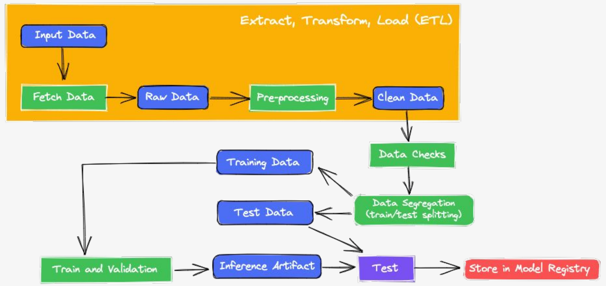

# Customer Purchase Prediction

In this project, we build a **binary classification model** using **PyTorch** to predict whether a customer will make a purchase based on a variety of demographic and behavioral features. This work was conducted as part of the *Machine Learning* course (PPGEEC2318) of the Graduate Program in Electrical and Computer Engineering at UFRN.

> **Professor:** Ivanovitch M. Silva  
> **Students:**  
> Leandro Roberto Silva Farias – 20251011748  
> Nicholas Medeiros Lopes – 20251011739

The complete pipeline includes fetching data, exploratory data analysis, preprocessing, data preparating, model training, evaluation, and reporting. The complete pipeline is contained in the `notebook.ipynb` file.


---

## Environment Setup

The following libraries are required to run the code:

```python
# Fetch data
import kagglehub
import os

# Data storing and analysis 
import pandas as pd
import numpy as np

# Data visualization
import matplotlib.pyplot as plt
import seaborn as sns

# Data preprocessing and preparation
from sklearn.model_selection import train_test_split
from sklearn.metrics import roc_auc_score, accuracy_score, mutual_info_score, confusion_matrix
from sklearn.preprocessing import StandardScaler
from sklearn.preprocessing import OneHotEncoder

# Model training
import torch
from torch.utils.data import Dataset, TensorDataset, DataLoader, WeightedRandomSampler, SubsetRandomSampler
from torch.utils.data.dataset import random_split
import torch.optim as optim
import torch.nn as nn
```

---

## Dataset Description

We use the **Customer Purchase Behavior** dataset from [Kaggle](https://www.kaggle.com/datasets/rabieelkharoua/predict-customer-purchase-behavior-dataset), which includes the following features:

- `Age`
- `Gender` (0 = Male, 1 = Female)
- `Annual Income` (USD)
- `Number of Purchases`
- `Product Category` (0–4)
- `Time Spent on Website` (minutes)
- `Loyalty Program` (0/1)
- `Discounts Availed` (0–5)
- **Target:** `PurchaseStatus` (0 = No Purchase, 1 = Purchase)

This is a **balanced** binary classification problem with approximately 48% `0` and 52% `1` labels.

---

## Model Details

- **Type**: Binary logistic regression
- **Framework**: PyTorch
- **Date**: 2025
- **Training Algorithm**: Stochastic Gradient Descent
- **Batch Size**: 64
- **Citation**: Dataset and model referenced from Kaggle and UFRN academic course project

---

## Pipeline Overview

### 1. Extract, Transform and Load (ETL)
The first step of the pipeline is to extract, transform and load the data. This is divided in the following substeps:

#### 1.1 Fetch data
Here, we extract the data from the kaggle website using the following commands

```python
# Download latest version of the dataset
path = kagglehub.dataset_download("rabieelkharoua/predict-customer-purchase-behavior-dataset")
print("Path to dataset files:", path)

# List files in the downloaded directory to find the CSV name
print(os.listdir(path))

# Load the CSV file (assuming it's named 'Admission_Predict.csv')
csv_file = os.path.join(path, 'customer_purchase_data.csv')
```

Then, the dataset is stores in a Pandas `Dataframe` variable.

```python
# Load into Pandas
df = pd.read_csv(csv_file)
````

#### 1.2 Exploratory Data Analysis (EDA)
This substep consists in analyzing and visualizing the dataset to summarize their main characteristics, detect patterns, spot anomalies, test assumptions, and check data quality before applying the machine learning model. For the Customer Purchase dataset, we did the following:

- Displayng the variable types of the data set
 ```python
df.info()
```
- Check if there are missing values
```python
df.isnull().sum()
```

- Separating the categorical and numerical features
```python
categorical_features = ['gender', 'productcategory', 'loyaltyprogram', 'purchasestatus']
numerical_features = [col for col in df.columns if col not in categorical_features]
```

- Check data distribution
```python
for col in numerical_features:
    sns.histplot(df[col], kde=True) # Draw a histogram, use KDE to smooth data distribution
    plt.title(col)
    plt.show()
```

```python
for col in categorical_features:
    print(f'Column: {col}, Unique values: {df[col].nunique()}')
    sns.countplot(x=col, data=df)
    plt.title(col)
    plt.show()
```

- Check correlation between the features and the target variable
```python
df[categorical_features].apply(lambda x: mutual_info_score(x, df.purchasestatus)).sort_values()
df[numerical_features].apply(lambda x: mutual_info_score(x, df.purchasestatus)).sort_values()
```

#### 1.3 Preprocessing
Preprocessing in a machine learning pipeline involves transforming raw data into a clean and suitable format for modeling. Based on the EDA, we saw that the dataset is well organized and balanced, without missing values. So, the only preprocessing we decided to do was to drop two features of the dataset which didn't seem to impact the target variable: `Gender` and `ProductCategory`.
```python
# Remove chosen columns from the dataset
columns_to_drop = ['gender', "productcategory"]
```

### 2. Data Preparation
The data preparationg step consists in organizing and formatting raw data to make it suitable for the machine learning task. In this project, we did the following:

- Split Dataset (Training/Validation)

### 2. Data Preparation

- Split Dataset (Training/Validation)
 ```python
# Ratio used to split train and validation data
val_size = 0.20

# Seed used to reproduce purposes
seed = 41

# Reference (column) to stratify the data
stratify = "purchasestatus"

# Split-out train/validation dataset
x_train, x_val, y_train, y_val = train_test_split(df.drop(labels=stratify,axis=1),
                                                  df[stratify],
                                                  test_size=val_size,
                                                  random_state=seed,
                                                  shuffle=True,
                                                  stratify=df[stratify])
 ```
- Target Variable Encoding
- Train/test split (70/15/15)

### 3. Model Training

- **Logistic Regression Model** implemented with PyTorch
- Loss function: Binary Cross Entropy
- Optimizer: Adam
- Batch training with DataLoader

### 4. Model Evaluation

- **Precision**
- **Recall**
- **Accuracy**
- Confusion matrix
- Probability distributions for each class

---

## Model Details

- **Type**: Binary logistic regression
- **Framework**: PyTorch
- **Date**: 2025
- **Training Algorithm**: SGD with Adam optimizer
- **License**: MIT
- **Citation**: Dataset and model referenced from Kaggle and UFRN academic course project

---

## Metrics

| Metric         | Value     |
|----------------|-----------|
| Precision      | ~0.84259  |
| Recall         | ~0.7      |
| Accuracy       | ~0.81333  |

> Threshold for classification set at 0.5.

---

## Intended Use

- **Educational**: Demonstrate classification model development from EDA to deployment.
- **Not intended**: For production or real financial/customer decision-making systems.

---

## Ethical Considerations

- Dataset is synthetic: No real user data involved.
- No fairness analysis included.
- No bias mitigation strategies applied.

---

## Caveats and Recommendations

- Do not apply this model to real-world data without retraining and thorough testing.
- Consider additional features like time-series behavior, clickstream, or device metadata for better real-world performance.
- Explore fairness and interpretability tools for further development.

---

## Future Work

- Add model versioning using DVC.
- Deploy model using FastAPI.
- Add CI/CD with GitHub Actions.
- Test other classification models (e.g., Random Forest, XGBoost).

---

## How to Cite

```bibtex
@misc{customerpurchase2025,
  author = {Farias, Leandro and Lopes, Nicholas},
  title = {Customer Purchase Behavior Prediction},
  year = {2025},
  note = {Graduate project, UFRN - PPGEEC2318}
}
```
